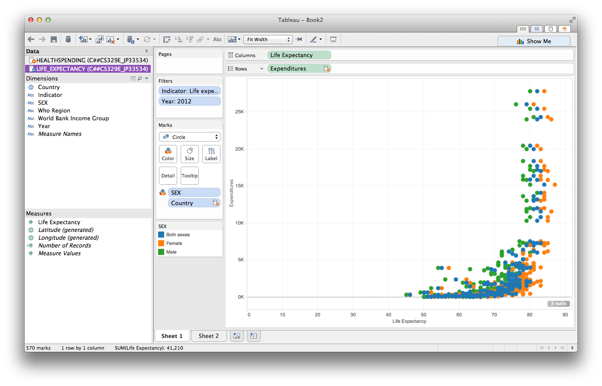
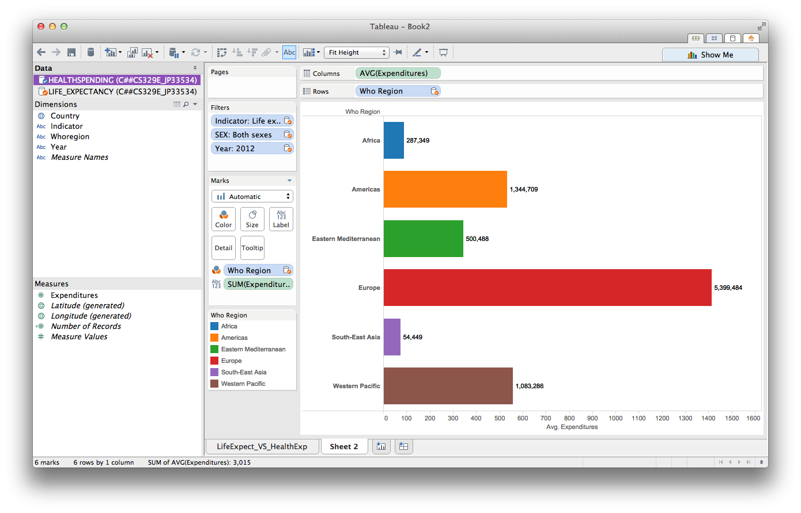
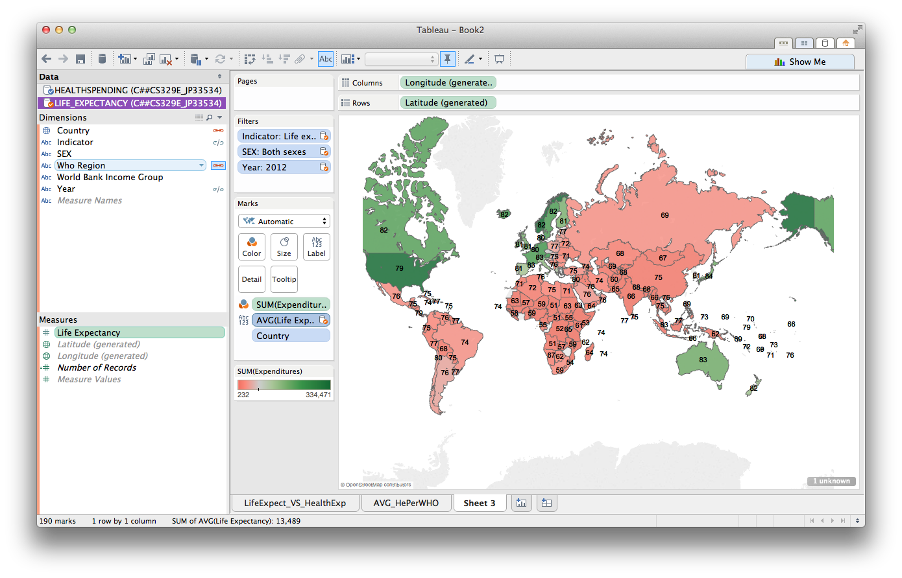

> *Summary*: In this project, the data sets used for this assignment are from a previous project done on life expectancy and health expenditures by country. We recreated some plots using Tableau software that were originally done in R with the ggplot package . 

* Data set can be found on the World Health Organization website
    + Life Expectancy: http://apps.who.int/gho/data/view.main.680
    + Health Expenditures: http://apps.who.int/gho/data/view.main.1920ALL?lang=en

Required package to create this html: *knitr*
Required software to create plots: *Tableau 8.0*

```{r,message=FALSE, echo=FALSE}
require("knitr")
```

###Blending in Tableau###
> *Description*: We took two data sets each in an Oracle server, and we added them as a data sources to a Tableau workbook found in the folder named 02 Tableau Workbook.

###Life Expectancy vs. Health Expenditures per country in 2012 ###
> *Description*:

 

###Average Expenditures per World Health Organization Region (WHO-Region)###
> *Description*: In this plot, we show World Bank income groups, the countries belonging in those groups, the countries' life expectancies in 2012, the maximum life expectancy along the pane, and the differences in life expectancy along the pane.

 

###Average Life Expectancies per World Health Organization Region (WHO-Region)###
> *Description*: We show a bar graph of average life expectancy of each WHO-Region, calculated by the life expectancies of the countries in each WHO-Region. This is a summary statistic that we can use to compare the state of WHO-Regions.

 

###Average Life Expectancies per country with color coded Health Expenditures###
> *Description*: This plot can help visualize which country spends the most on healthcare, and one can see that health spending does not necessarily equal a longer life per capita.



